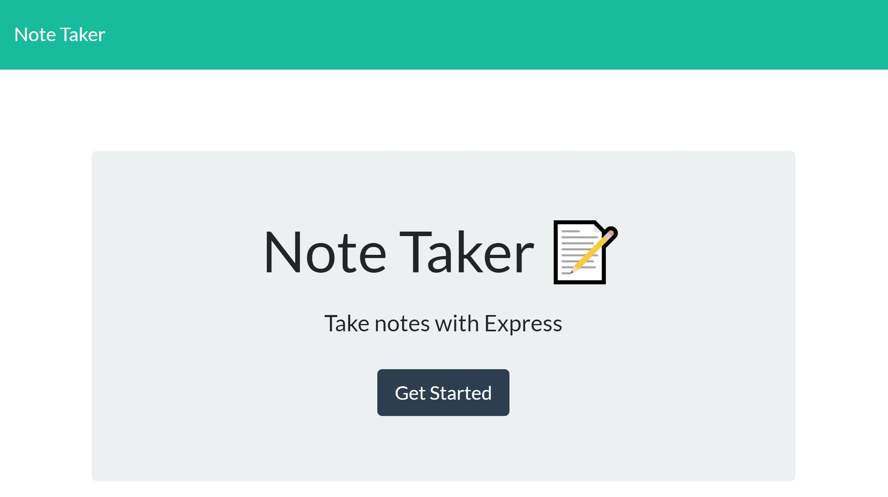
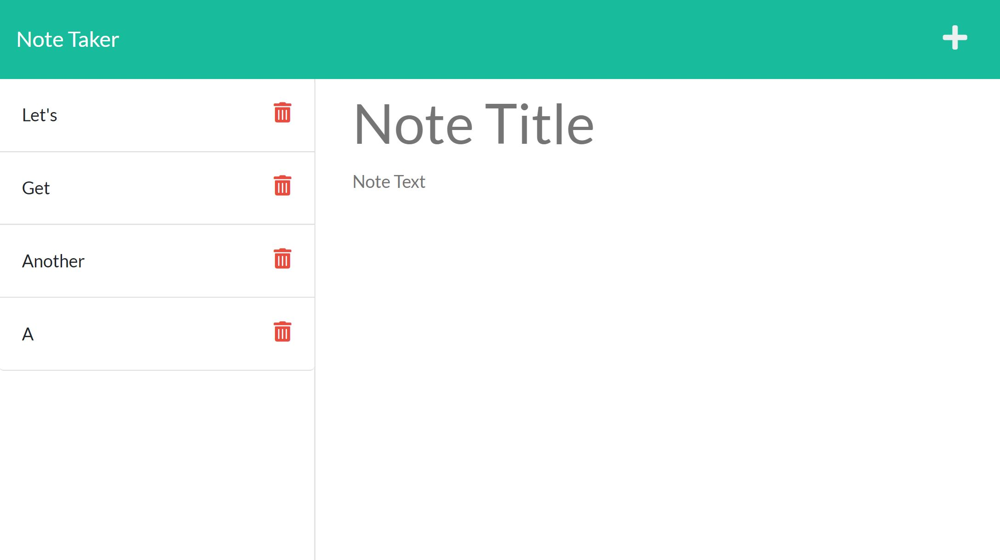

# c11-Note-Taker

## Description

An app for writing and saving notes that uses an Express.js back end and will save and retrieve note data from a JSON file.

[GitHub Repository](https://github.com/claire-sky/c11-Note-Taker)

[Deployed Application](https://murmuring-ravine-50338.herokuapp.com/notes)

## Usage 

* Click the link on the landing page to enter the notes page.
* Add a new note with the plus sign in the upper right
* Enter a note title and description on the right side
* Save with the save button in the upper right
* Revisit an existing note by clicking it on the right
* Delete functionality to come

## License
[The Unlicense](https://spdx.org/licenses/Unlicense.html)
This is free and unencumbered software released into the public domain.

Anyone is free to copy, modify, publish, use, compile, sell, or distribute this software, either in source code form or as a compiled binary, for any purpose, commercial or non-commercial, and by any means.

In jurisdictions that recognize copyright laws, the author or authors of this software dedicate any and all copyright interest in the software to the public domain. We make this dedication for the benefit of the public at large and to the detriment of our heirs and successors. We intend this dedication to be an overt act of relinquishment in perpetuity of all present and future rights to this software under copyright law.

THE SOFTWARE IS PROVIDED "AS IS", WITHOUT WARRANTY OF ANY KIND, EXPRESS OR IMPLIED, INCLUDING BUT NOT LIMITED TO THE WARRANTIES OF MERCHANTABILITY, FITNESS FOR A PARTICULAR PURPOSE AND NONINFRINGEMENT. IN NO EVENT SHALL THE AUTHORS BE LIABLE FOR ANY CLAIM, DAMAGES OR OTHER LIABILITY, WHETHER IN AN ACTION OF CONTRACT, TORT OR OTHERWISE, ARISING FROM, OUT OF OR IN CONNECTION WITH THE SOFTWARE OR THE USE OR OTHER DEALINGS IN THE SOFTWARE.